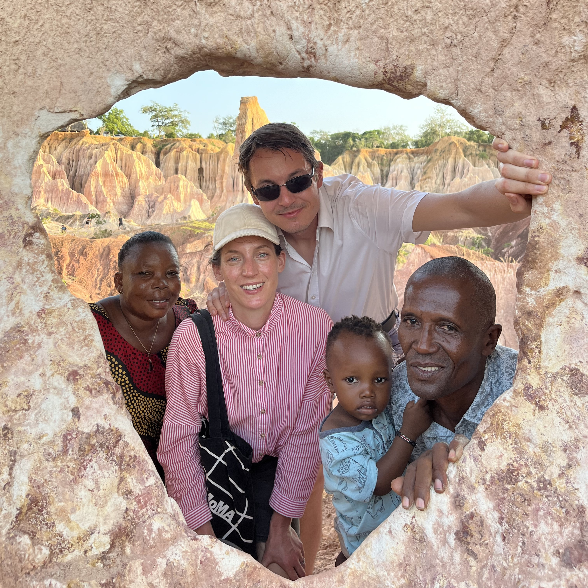
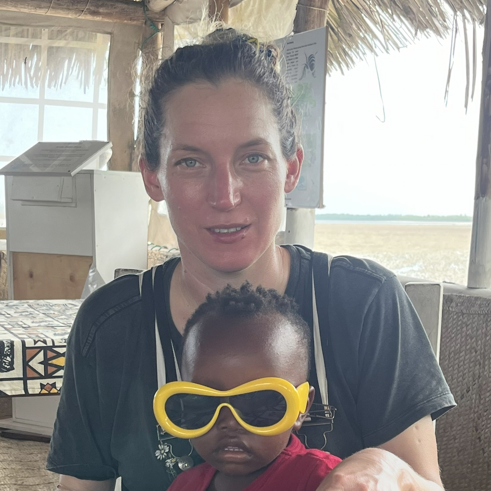
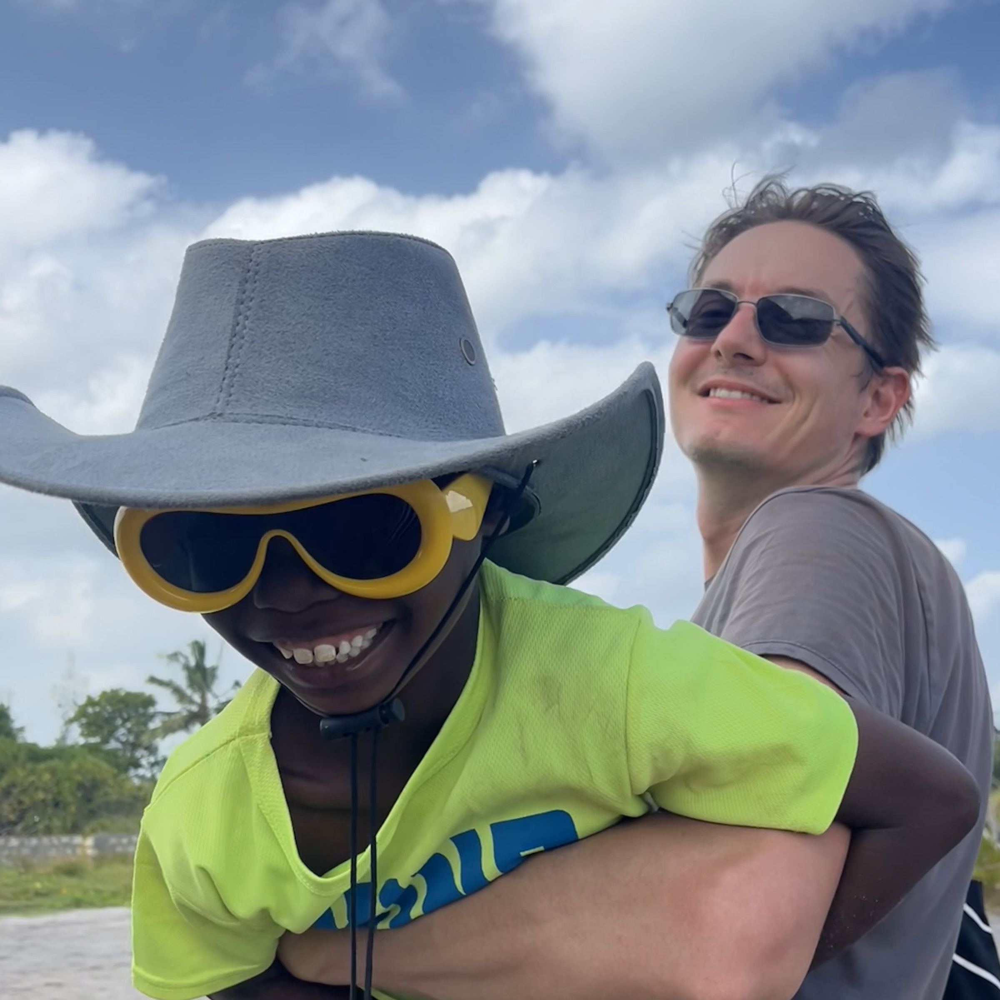
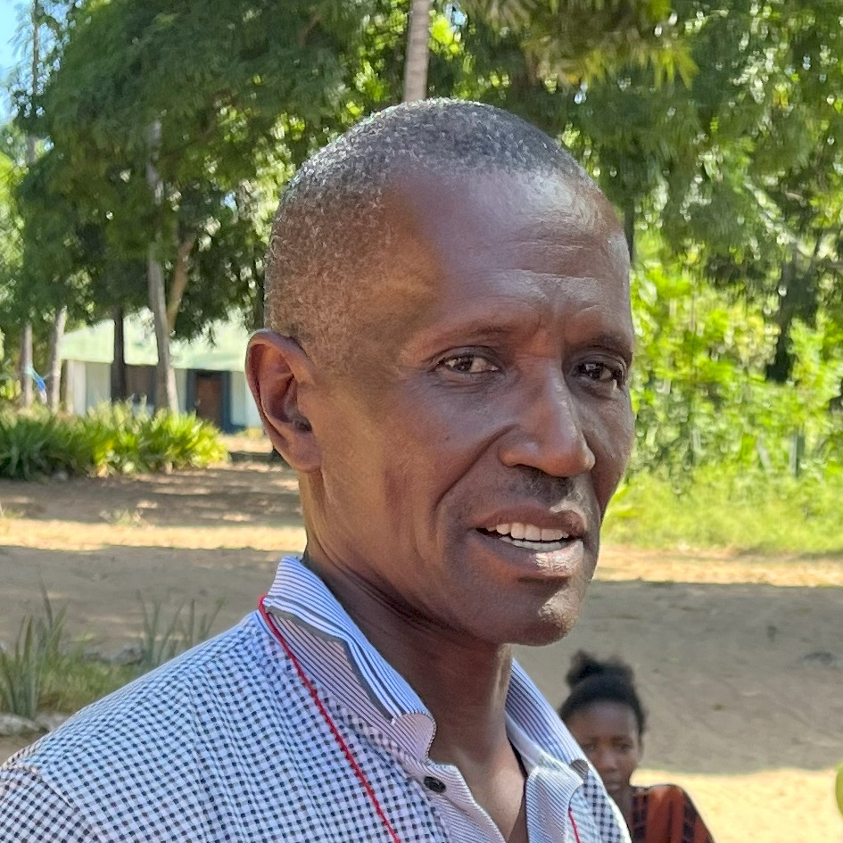
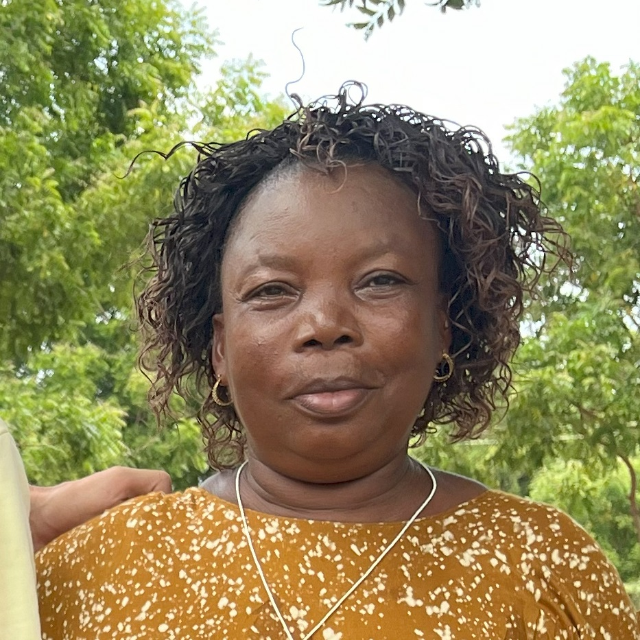
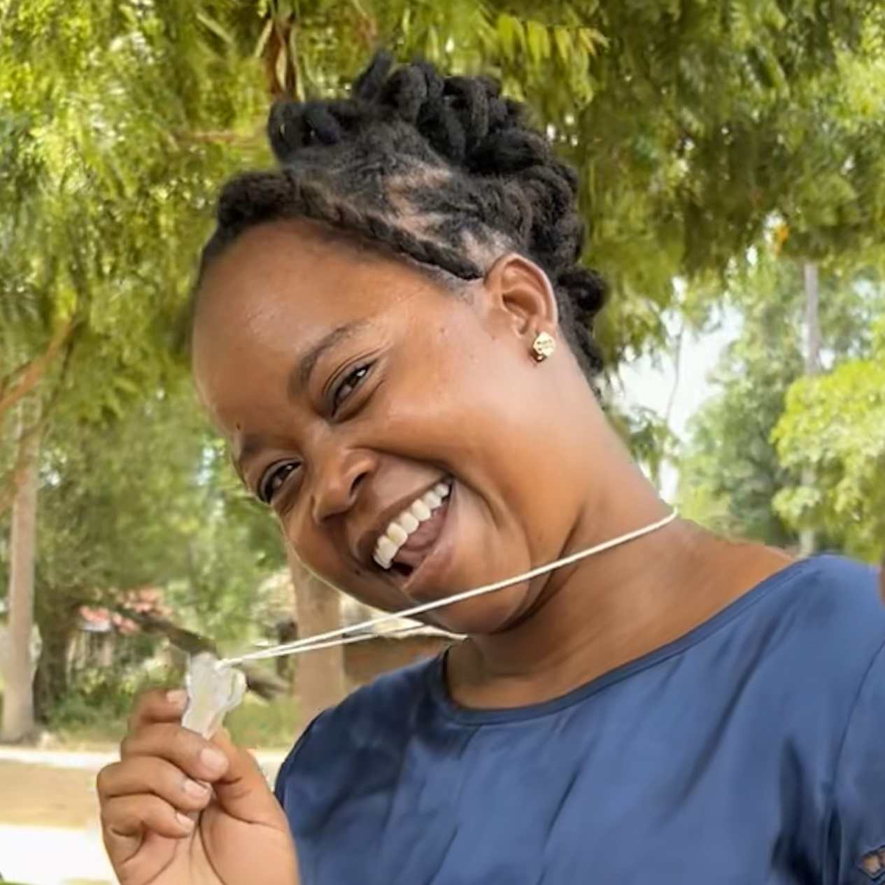
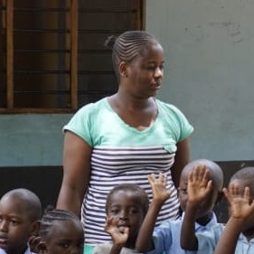
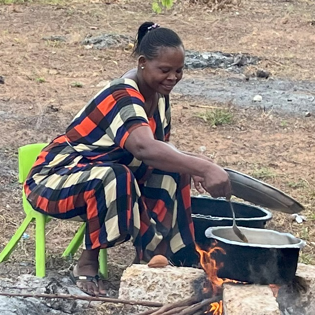

# Team

<!--author-->

{:.lead width="512" height="512" loading="lazy"}

Prisca, Adetta, Thomas, Teddy, and Danson (*left to right*) in 2024.
{:.figcaption}

1. this list will be replaced by the toc
{:toc .large-only}

{:.lead}
# Organizers
>Our Team of founders, builders, and fundraisers.

## Elisabeth 'Adetta' Heynold
<!----->
{:.tail width="512" height="512" loading="lazy"}

 Adetta is one of the founding members of ElMaMa. She is our point person and leader, she funded and oversaw the original building phase and continued to support the project through the Covid pandemic in 2020. Outside of ElMaMa she is a resident neurosurgeon and researcher in neuroscience in New York, USA.

## Thomas Hainmueller
{:.tail width="512" height="512" loading="lazy"}

Thomas joined the project along the way. He has been supporting Adetta in management and funding acquisition and is our webmaster for this site. When he's not blogging for ElMaMa, he is a resident psychiatrist and neuroscientist in New York, USA.

## Danson Kirao
{:.tail width="512" height="512" loading="lazy"}

Danson is a founder and the heart and sould of ElMaMa. It was on his initiative and on land that he inherited for this purpose that the initial ElMaMa buildings were erected. He has been tirelessly coordinating help in Watamu and the other communities we support. As a retired teacher and pastor, Danson has deep insights into the struggles and needs of the local communities.

## Prisca Kirao
{:.tail width="512" height="512" loading="lazy"}

Prisca is another integral part of our success. As a village elder, she is deeply rooted in the local community and can steer help to where its needed most.

{:.lead}
# Kindergarten
> Our dedicated teachers and support staff.

## Madame Gladys
{:.tail width="512" height="512" loading="lazy"}

As our head teacher, Madame Gladys takes excellent care of our pre-schoolers and 1st graders.

## Madame Patience
{:.tail width="512" height="512" loading="lazy"}

Madame Patience is a teacher by heart and soul and helps our children grow.

## Madame Priscilla
{:.tail width="512" height="512" loading="lazy"}

Madame Priscilla is a dedicated teacher and educator for our kindergarteners and pre-schoolers.

## Madama Mary
{:.tail width="512" height="512" loading="lazy"}

Madame Mary is our dedicated chef and diligently prepares breakfast and lunch for our children making sure nobody has to go home hungry.

{:.lead width="512" height="512" loading="lazy"}

{:.lead width="1920" height="1080" loading="lazy"}

{:.lead width="1920" height="860" loading="lazy"}
